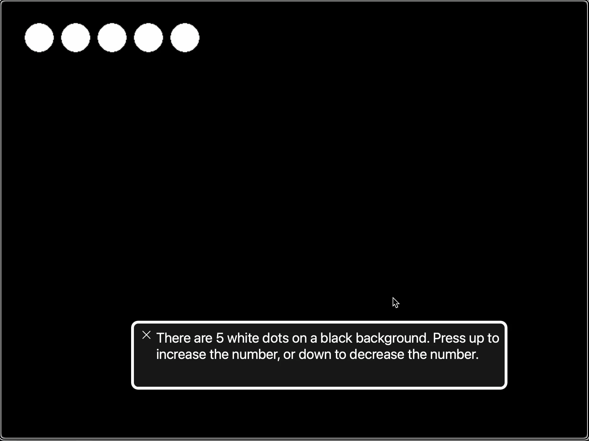

# love2d-a11y-template

Accessible HTML template for [LÖVE / Love2d](https://love2d.org/) games, with a live read out for screen readers.



## Requirements

This depends on you being able to export your game with [love.js](https://github.com/2dengine/love.js).

## What is it?

There are three files included in this project that you can copy or reference for your own project. These are based on the love2d-electron-template, and allow you to have both a web export, and a standalone distributable.

<dl>

<dt><code>index.js</code></dt>
<dd>This is the javascript entrypoint for the electron app (if you choose to make a standalone distributable). This will run the hosted instance of the love.js project.</dd>

<dt><code>a11y_template.html</code></dt>
<dd>This is a modified template to center and expand the canvas of the game based on the window size. Specific to this repository, we also bake in a live aria element to read out the state of the game, and enable pinch-zoom in the canvas.</dd>

<dt><code>build.sh</code></dt>
<dd>This is a set of scripts that you'll want to run to build the final project. You can either trigger this as a shell script, or include it as part of some other build tooling (or even a package.json).</dd>

</dl>


## How to Run your game

After you copy the above files into the root folder of your project, you can start the game in either a web browser or as a standalone app.

### Web Instance

```sh
./build.sh FOLDER_NAME
npx serve FOLDER_NAME
```

Where `FOLDER_NAME` is whatever folder you want to create with `love.js`.

### Standalone Instance

To run as an electron app, you can use similar steps as above, instead running the following:

```sh
./build.sh FOLDER_NAME
npx electron FOLDER_NAME
```

To build a standalone executable, follow the instructions in [here](https://github.com/JRJurman/love2d-electron-template?tab=readme-ov-file#packaging-your-project).

## How To Use the Screen Reader output

Throughout the development process, add `print` statements with the `tts:` prefix.

```lua
function love.load()
  print("tts:New Game Started!")
end
```

These will be consumed by the html template to be read out by screen readers. This text will also be visible for sighted users looking at the page.

## Sample

You can check out the sample project in the folder in this project, which has gone through all the above steps.

## Motivation

This gives developers an easy interface to work with, and allows end-users to use any browser-compatible screen reader. The interface and presentation is non-invasive for users who don't need screen-reader support, while offering that option for users who would benefit from it.

## Suggestions / PRs

PRs are definitely welcome, although this template should be considered more of a starting point for developers. It is not the intent that the template should be visually perfect for every game, rather, the expectation is that any developer can polish the web-page for whatever game or project they are building.

If there are accessibility issues with the template, or ways we could make the experience here more straight-forward, feel free to create issues on this repo, or provide PRs!
